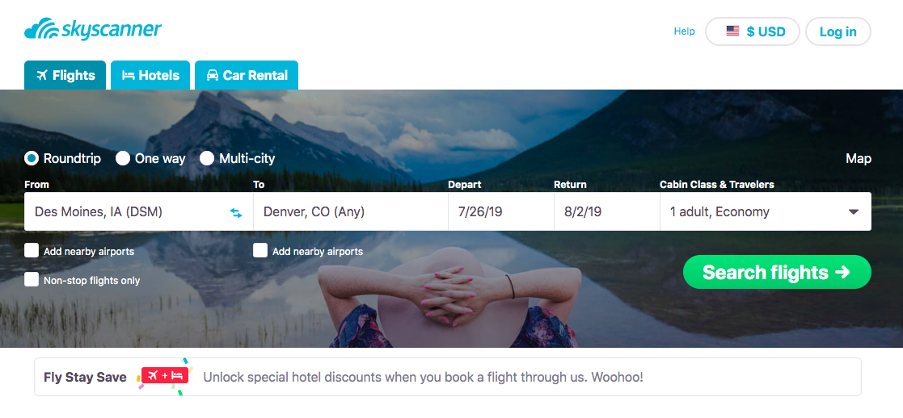
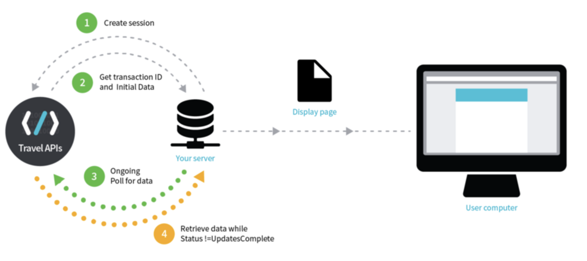

```{r global_options, include = FALSE}
knitr::opts_chunk$set(eval = F, warning = F, message = F, comment = "", fig.align = "center")
```

```{r, echo=FALSE, eval=TRUE}
library(flightscanner)
library(dplyr)
```

# Motivation 

- "All flights cost money, but some are affordable!"

--

- Existing flight searching engines (e.g. [Google Flight](https://www.google.com/flights?hl=en#flt=/m/02j3w..2019-05-20*./m/02j3w.2019-05-24;c:USD;e:1;ls:1w;sd:0;t:h) is a very good flight searching engine, how could we beat products alike?).

--

- They are not perfect: distracting ads/ no map of origin & destination/ cannot search automatically.

--

- Our goal: build a flight searching R package and Shiny APP from 0, and solve the problems we noticed. 

--

- Google Flight API was deprecated on April/10/2018. Instead, we used Rapid API which enquires data from Skyscanner.

---
# Skyscanner

[Skyscanner](https://www.skyscanner.com/) is a travel fare aggregator website and travel metasearch engine based in Scotland, owned by Ctrip, the largest travel company in China.

```{r, out.width='100%', echo=FALSE, eval=TRUE}

```

--

[Skyscanner flight search via Rapid API (free)](https://rapidapi.com/skyscanner/api/skyscanner-flight-search)

---
class: inverse, center, middle

# Get Started

---

# Hello FlightScanner!


Install the **FlightScanner** package from [Github](https://github.com/MinZhang95/flightscanner)

```r
devtools::install_github("MinZhang95/flightscanner")
```

--

Main files:

- api.R

--

- database.R

--

- dataprocess.R

---

# api.R \- SetAPI
Set API key globally
```r
SetAPI <- function(key) {
  options(APIkey = key)
}
```

--
- Process of create session and poll session


---
# api.R \- apiCreateSession
Create a session with query details and get a session ID
```r
apiCreateSession(
  origin, destination,
  startDate, returnDate = NULL,
  adults = 1, children = NULL, infants = NULL,
  country = "US", currency = "USD", locale = "en-US",
  cabinClass = c("economy", "premiumeconomy", "business", "first"),
  includeCarriers = NULL, excludeCarriers = NULL)
```


---
# api.R \- apiPollSession
Use session ID to poll results, sort results and filter results farther.
```r
apiPollSession(
  response, sortType = c("price", "duration", "carrier",
                         "outboundarrivetime", "outbounddeparttime",
                         "inboundarrivetime", "inbounddeparttime"),
  sortOrder = c("asc", "desc"),
  duration = NULL, stops = NULL,
  includeCarriers = NULL,
  excludeCarriers = NULL,
  originAirports = NULL,
  destinationAirports = NULL,
  outboundDepartTime = NULL,
  outboundDepartStartTime = NULL, 
  outboundDepartEndTime = NULL,
  outboundArriveStartTime = NULL,
  outboundArriveEndTime = NULL,
  inboundDepartTime = NULL,
  inboundDepartStartTime = NULL, inboundDepartEndTime = NULL,
  inboundArriveStartTime = NULL, inboundArriveEndTime = NULL)
```

---
# unpack.R
There are several sub-list in the content of output of PollSession, such as itineraries, legs, segments, etc. 
--
$$
\text{search result} 
\begin{cases}
  \text{itinerary_1} 
    \begin{cases}
      \text{leg_1} 
        \begin{cases}
          \text{segment_1} \\
          \text{segment_2} \\
          \vdots \\
          \text{segment_S}
        \end{cases} \\
      \text{leg_2} 
        \begin{cases}
          \text{segment_1}
        \end{cases}
    \end{cases} \\
  \text{itinerary_2} 
    \begin{cases}
      \text{leg_1} 
        \begin{cases}
          \text{segment_1} \\
          \text{segment_2} 
        \end{cases} \\
      \text{leg_2} 
        \begin{cases}
          \text{segment_1}
        \end{cases}
    \end{cases} \\
  \vdots \\
  \text{itinerary_n} 
    \begin{cases}
      \text{leg_1} 
        \begin{cases}
          \text{segment_1} 
        \end{cases} \\
      \text{leg_2} 
        \begin{cases}
          \text{segment_1}
        \end{cases}
    \end{cases}
\end{cases}
$$
Each sub-list has its own variables, we need to write some functions to extract each sub-list and link them together.

---
# unpack.R
Here is a set of functions we write to extract each sub-list of the response and store it in dataframes.
- GetPrice

- GetItineraries

- GetLegs

- GetSegments

- GetCarriers

- GetAgents

- GetPlaces

---
# unpack.R \- GetPrice
```{r, echo=FALSE, eval=TRUE}
name <- load("extdata/respshow.rda")
response <- get(name)
data <- GetData(response)
head(data$price,3) %>% print(width = 120)
cat("-------------------------------------------------------")
data$price$PricingOptions[[1]] %>% print(width = 60)
```

---
# unpack.R \- GetLegs
```{r, echo=FALSE, eval=TRUE}
head(data$legs, 3) %>% print(width = 110)
cat("-------------------------------------------------------")
data$legs$SegmentIds[[1]]
cat("-------------------------------------------------------")
data$legs$Stops[[1]]
```

---
# unpack.R \- GetSegments
```{r, echo=FALSE, eval=TRUE}
head(data$segments) %>% print(width = 120)
```

---
# unpack.R \- GetCarriers
```{r, echo=FALSE, eval=TRUE}
head(data$carriers %>% filter(Code != ""))[1:3]
```

---
# unpack.R \- GetAgents
```{r, echo=FALSE, eval=TRUE}
head(data$agents)[1:3]
```

---
# unpack.R \- GetPlaces
```{r, echo=FALSE, eval=TRUE}
head(data$places)
```

---
# dataprocess.R
This file has some functions to deal with the data. Two main functions:

--

- **GetData**: obtain some data.frames from the source.

    - **GetData.response**  
      extract data from API (response).
      
    - **GetData.SQLiteConnection**  
      read data from SQLite database (connection).

--

- **FilterFlight**: filter flights with user-provided conditions.

---
# dataprocess.R \- GetData
```{r, out.width='65%', echo=FALSE, eval=TRUE}

```
```r
GetData(x, ...)
```

2 methods:
- `response`: from API
- `SQLiteConnection`: from SQLite database

--

Return a list of 7 tibbles, using functions in unpack.R.

- Price
- Itinerary
- Leg
- Segment
- Carrier
- Agent
- Place

---
# dataprocess.R \- FilterFlight
```r
FilterFlight(
  x, max_price, max_duration, max_stops, layover,
  carrier_include, carrier_exclude,
  out_departure, out_arrival, in_departure, in_arrival)
```

| parameter | description |
|:---------|:------------|
| x | A list of data.frame. (from GetData) |
| max_price | Maximum price. |
| max_duration | Maximum duration in minutes. |
| max_stops | Maximum number of stops. |
| layover | Range of layover in minutes. |
| carrier_include, carrier_exclude | Include / Exclude specified carriers. |
| out_departure, out_arrival, in_departure, in_arrival | Range of outbound / inbound departure / arrival time. |

---
# database.R
- Why **database**?
    - Scrape and save data for a period to see the price change over time.
    - Fast using SQL.

--

- Why **SQLite**?
    - Server-free, configuration-free, administration-free. Easy to use.
    - On-disk file format. Improve performance and reliability, reduce cost and complexity.
    - Very light size, compared to MySQL, Oracle, etc.
    
--

Our key functions (mainly depends on `DBI` and `RSQLite` package):

- **dbCreateDB**: Connect to / create a SQLite database file, create 7 tables.

- **dbSaveData**: Save data to SQLite database.

- **ListUnpack**, **ListPack**: Unpack / pack tibbles.

---
# database.R \- dbCreateDB
```r
dbCreateDB(conn = RSQLite::SQLite(), dbname = "flight.db")
```

Function:
1. Connect to SQLite driver

2. Create a local database file "flight.db" if not exists.

3. Create 7 tables if not exist in the database.  
    - Price, Itineries, Legs, Segments, Agents, Carriers, Places.

---
# database.R \- ListUnpack, ListPack
Convert betweeen object and character string. Since SQLite doesn't support `list` as the element of `data.frame`. An example:

```{r, echo=FALSE, eval=TRUE}
df <- tibble(a = LETTERS[1], b = list(data.frame(x = 9:10)))
df
cat("-------------------------------------------------------")
flightscanner:::ListUnpack(df, mutate = T) %>% print(width = 100)
cat("-------------------------------------------------------")
df$b[[1]]
```

---

# Automatical Key Checking

One of our package's feature is the automatcial key checking when loading the package.

If there is no file named **APIkey.txt** in the working directory, then an interactive function **keychecking** will run.

```r
library(flightscanner)
#
# API key is required!
# Please follow the instructions to get the key:
# 1. Browse and login:  https://rapidapi.com/skyscanner/api/skyscanner-flight-search 
#    Do you want to visit this website (1 for YES; 0 for NO)?
#
# 1 or 0
#
# 2. Copy the value of X-RapidAPI-Key in Header Parameters.
#    Paste your key (without quote):
#
# xxxxxxxxxxxxxxxxxxxxxxxxxx
```

---

# Cont'd

If the input API is not valid, then it will show the message 

```{r, echo=FALSE, eval=TRUE}
cat("Check your API key or network connection.\nAnd use SetAPI to set your key later.")
```

otherwise

```{r, echo=FALSE, eval=TRUE}
cat("Welcome to FlightScanner!")
```

The key will be stored in **APIkey.txt** at the current directory and can be used in the future.

---

# Automatical data download

Another feature of our package is the automatcial data download when even quit the Rstudio. This feature is based on the package "cronR"

```r
# create jobs
CreateJob("DSM", "DTW", "2019-06-01", frequency = "minutely")
CreateJob("DSM", "DTW", "2019-06-01", frequency = "hourly")
CreateJob("DSM", "DTW", "2019-06-01", "2019-06-10",
          frequency = "hourly", at = "3AM")

# show the jobs
cron_ls() 

# clear all the jobs
cron_clear(ask = FALSE)
```

Two files will be generated:

- log file: script_DSM_DTW_2019-06-01.log

- database: flight.db

---
# Cont'd

log file: script_DSM_DTW_2019-06-01.log
```r
# Time: 2019-05-05 09:00:00
# Welcome to FlightScanner!
# Working Directory: /Users/xin/Documents/Course/STAT585/flightscanner/inst
# API Key: 3e85a0e43cmshac6dba6fde57066p1c1145jsn1e6f8c3d0e33
# Command Line Arguments:  DSM DTW 2019-06-01 
# Try to update data 16 times.
# Warning message:
# Unmatch of Segments and Stops: [LegId] = 11140-1906010743--30963,-32462-3-11152-1906020959 

# Time: 2019-05-05 13:00:01
# Welcome to FlightScanner!
# Working Directory: /Users/xin/Documents/Course/STAT585/flightscanner/inst
# API Key: 3e85a0e43cmshac6dba6fde57066p1c1145jsn1e6f8c3d0e33
# Command Line Arguments:  DSM DTW 2019-06-01 
# Try to update data 9 times.
# Warning message:
# Unmatch of Segments and Stops: [LegId] = 11140-1906010743--30963,-32462-3-11152-1906020959 
```

---

# Cont'd

database: flight.db

```{r, eval=TRUE}
# connect to SQLite database
con <- dbCreateDB(dbname = "flight.db")

# read data from database
data <- GetData(con)  
dbListTables(con)
unique(data$price$SearchTime)

# disconnect database
dbDisconnect(con)
```

---
# Shiny App

Imagine that we plan to attend JSM 2019 this summer, and we are so lazy that we don't want to drive...


Raw travel plan:

- Des Moines to Denver

- July 26 - Aug 2, 2019

- Anything else?

---
# Future work

- Meet more customized requirements: 

    filter with class, transit stops, infants, and etc.

- Accumulated data: 

    temporal plot showing the price fluctuations. Diviniations may help us know when to buy the tickets with the lowest price!
    


---
class: inverse, center, middle
# Thanks! 

